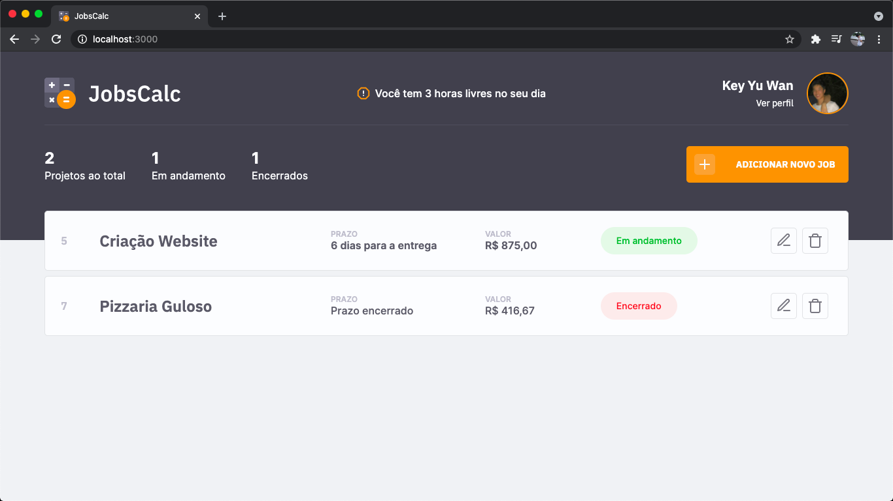
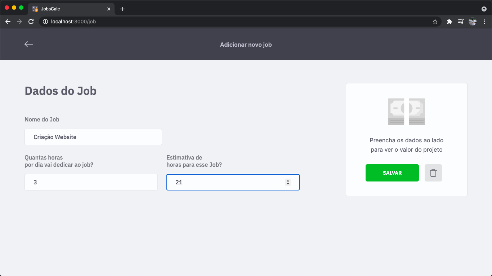
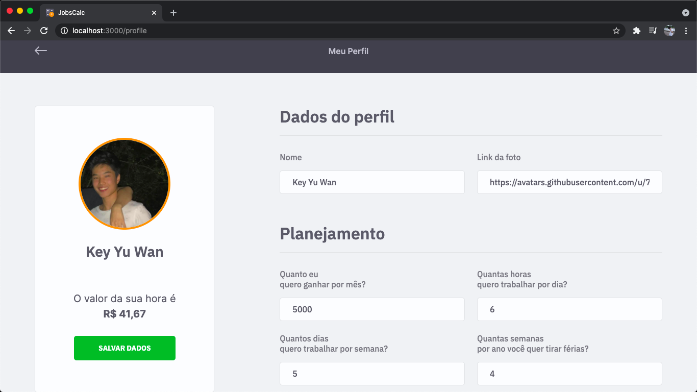

<h1 align="center">
  
</h1>

  <a href="#-tecnologias">Tecnologias</a>&nbsp;&nbsp;&nbsp;|&nbsp;&nbsp;&nbsp;
  <a href="#-projeto">Projeto</a>&nbsp;&nbsp;&nbsp;|&nbsp;&nbsp;&nbsp;
  <a href="#memo-licença">Licença</a>

 

  

 

# 📸 Overview:

# 💻 Projeto

• O JobsCalc é uma aplicação de estimativa de cálculo para projetos freelancer, onde é possível cadastrar e excluir jobs (projetos), obtendo uma estimativa de custo de cada job. Além disso, é possível traçar o valor da hora da pessoa que estará usando o sistema 💰    
• O Projeto foi desenvolvido na maratona discover 2 elaborado pela Rocketseat.
   
• A aplicação conta tanto com o Front-end quanto com o Back-end.

# 🚀 Tecnologias

Esse projeto foi desenvolvido com as seguintes tecnologias:

#### ✔️ HTML  
#### ✔️ CSS  
#### ✔️ JavaScript  
#### ✔️ NodeJS  
#### ✔️ EJS  
#### ✔️ Express  
#### ✔️ SQLite

# 📝 Licença

Esse projeto está sob a licença MIT. Veja o arquivo [LICENSE](.github/LICENSE.md) para mais detalhes.

